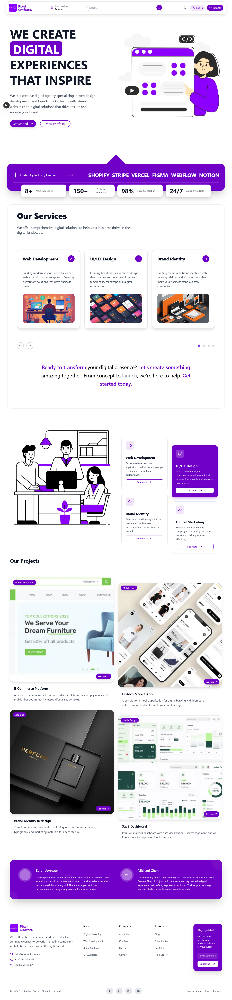

<h1 align="center">Pixel Crafters Agency - Premium Digital Agency Website</h1>
<div align="center">
  
</div>

## 🌟 About The Project

Pixel Crafters Agency is a **premium digital agency website** that showcases modern web development capabilities and digital marketing services. Built with cutting-edge technologies and user experience at its core, this platform demonstrates what's possible when innovative design meets professional digital agency needs.

### 🎯 What Makes It Special

- **🚀 Performance First**: Lightning-fast loading with Next.js 15 and optimized assets
- **🎨 Modern Design**: Clean, professional design following latest UI/UX trends
- **📱 Universal Design**: Seamless experience across all devices and screen sizes
- **🌙 Adaptive Theming**: Intelligent dark/light mode with user preference persistence
- **⚡ Interactive Elements**: Smooth animations and micro-interactions
- **🔧 Modern Architecture**: Type-safe development with TypeScript and scalable components
- **♿ Accessibility**: WCAG compliant design ensuring inclusivity for all users
- **🔒 Security**: Best practices implemented for user data protection

### 🎪 Live Features

- **Dynamic Hero Section** with compelling call-to-action and agency highlights
- **Interactive Service Showcase** with detailed digital marketing and web development services
- **Responsive Navigation** with smooth transitions and mobile optimization
- **Authentication System** with secure login/signup functionality
- **Theme Switching** with smooth transitions and preference storage
- **Professional Portfolio** showcasing agency capabilities and client work
- **Contact Integration** for client inquiries and business development

## 📋 Table of Contents

- [🌟 About The Project](#-about-the-project)
- [📸 Screenshots](#-screenshots)
- [✨ Features](#-features)
- [🛠️ Tech Stack](#️-tech-stack)
- [📦 Installation](#-installation)
- [🚀 Deployment](#-deployment)
- [📁 Project Structure](#-project-structure)
- [🎯 Key Components](#-key-components)
- [🔧 Customization](#-customization)
- [📈 Performance](#-performance)
- [🤝 Contributing](#-contributing)
- [📄 License](#-license)

## 📸 Screenshots

### Home Page
<div align="center">
  
  
  <p><em>Home page showcasing agency services with light and dark themes</em></p>
</div>

### Authentication Pages
<div align="center">
  
  
  
  <p><em>Modern authentication system with theme-aware design</em></p>
</div>

## ✨ Features

### 🎨 **Design & User Experience**

| Feature | Description | Technology |
|---------|-------------|------------|
| **Responsive Design** | Pixel-perfect across all devices (mobile, tablet, desktop) | Tailwind CSS + CSS Grid/Flexbox |
| **Dark/Light Theme** | Intelligent theme switching with user preference persistence | CSS Variables + Next Themes |
| **Modern UI/UX** | Clean, professional design following latest design trends | Tailwind CSS + Radix UI |
| **Interactive Elements** | Smooth hover effects and micro-interactions | CSS Transitions + Animations |
| **Accessibility** | WCAG 2.1 AA compliant with keyboard navigation support | Semantic HTML + ARIA |

### 🚀 **Core Functionality**

| Feature | Description | Implementation |
|---------|-------------|----------------|
| **Authentication** | Secure login/signup system with form validation | React Hook Form + Validation |
| **Theme System** | Seamless dark/light mode switching | Next Themes + CSS Variables |
| **Responsive Navigation** | Mobile-first navigation with smooth animations | React State + CSS Transitions |
| **Component Library** | Reusable UI components with consistent styling | Radix UI + Class Variance Authority |
| **Icon System** | Beautiful, consistent iconography | Lucide React |

### 📱 **Pages & Functionality**

- **🏠 Home Page**: Dynamic hero section showcasing digital agency services
- **🔐 Authentication**: Secure login/signup system with form validation
- **📱 Mobile Navigation**: Responsive hamburger menu with smooth animations
- **🎨 Theme Switching**: Seamless dark/light mode with user preference storage
- **💼 Professional Design**: Clean, modern interface suitable for business clients

### 🛠️ **Technical Excellence**

- **⚡ Performance**: Optimized for Core Web Vitals with excellent Lighthouse scores
- **🔍 SEO Ready**: Meta tags and structured data for search engine optimization
- **📱 Mobile First**: Responsive design ensuring perfect mobile experience
- **🔒 Security**: XSS protection and secure coding practices
- **🌐 Modern Standards**: Built with latest web standards and best practices

## 🛠️ Tech Stack

### **Frontend**
```typescript
// Core Technologies
Next.js 15.4.6    // React framework with App Router
React 19.1.0      // Latest React with concurrent features
TypeScript 5      // Type-safe JavaScript
Tailwind CSS 4    // Utility-first CSS framework
```

### **UI Components & Styling**
```typescript
// UI & Components
Radix UI          // Accessible component primitives
Lucide React      // Beautiful icon library
Class Variance Authority  // Component variant management
clsx & tailwind-merge    // Conditional styling utilities
tw-animate-css    // Animation utilities
```

### **Additional Libraries**
```typescript
// Enhanced Functionality
Swiper 11.2.10    // Touch slider component
Next Themes       // Theme switching (inferred from usage)
```

### **Development Tools**
```typescript
// Development & Build
ESLint 9          // Code linting and formatting
TypeScript 5      // Static type checking
Turbopack         // Fast bundler for development
```

## 🚀 Getting Started

### Prerequisites

Before you begin, ensure you have the following installed on your local machine:

- **Node.js** (v18.0.0 or higher) - [Download here](https://nodejs.org/)
- **npm** (v8.0.0 or higher) or **pnpm** (recommended)
- **Git** - [Download here](https://git-scm.com/)

### 📦 Installation

1. **Clone the repository**
   ```bash
   git clone https://github.com/AliBaig102/Pixel-Crafters-Agency.git
   cd Pixel-Crafters-Agency
   ```

2. **Install dependencies**
   ```bash
   # Using npm
   npm install
   
   # Or using pnpm (recommended)
   pnpm install
   ```

3. **Run the development server**
   ```bash
   # Using npm
   npm run dev
   
   # Or using pnpm
   pnpm dev
   ```

4. **Open your browser**
   Navigate to [http://localhost:3000](http://localhost:3000) to see the application.

### 🔧 Available Scripts

```bash
# Development
npm run dev          # Start development server with Turbopack
npm run build        # Build for production
npm run start        # Start production server
npm run lint         # Run ESLint
```

## 🚀 Deployment

### Vercel (Recommended)

The easiest way to deploy your Next.js app is to use the [Vercel Platform](https://vercel.com/new?utm_medium=default-template&filter=next.js&utm_source=create-next-app&utm_campaign=create-next-app-readme).

1. **Connect your GitHub repository** to Vercel
2. **Configure build settings** (auto-detected for Next.js)
3. **Deploy** - Your app will be live in minutes!

### Manual Deployment

```bash
# Build the application
npm run build

# Start the production server
npm run start
```

## 📁 Project Structure

```
pixel-crafters-agency/
├── 📁 public/                    # Static assets
│   └── 🖼️ images/               # Screenshots and assets
├── 📁 src/                      # Source code
│   ├── 📁 app/                  # Next.js App Router
│   │   ├── 📄 layout.tsx        # Root layout
│   │   ├── 📄 page.tsx          # Home page
│   │   ├── 📄 globals.css       # Global styles
│   │   ├── 📁 login/            # Login page
│   │   │   └── 📄 page.tsx
│   │   └── 📁 signup/           # Signup page
│   │       └── 📄 page.tsx
│   └── 📁 components/           # Reusable components
│       ├── 📁 custom/           # Custom components
│       │   ├── 🧭 header.tsx
│       │   ├── 🦶 footer.tsx
│       │   ├── 📝 login-form.tsx
│       │   └── 📝 signup-form.tsx
│       └── 📁 ui/               # UI components
│           ├── 🔘 button.tsx
│           ├── 📝 input.tsx
│           └── 🎴 card.tsx
├── 📁 images/                   # README screenshots
├── 📄 package.json              # Dependencies
├── 📄 tailwind.config.js        # Tailwind configuration
├── 📄 next.config.js            # Next.js configuration
├── 📄 tsconfig.json             # TypeScript configuration
└── 📄 README.md                 # Project documentation
```

## 🎯 Key Components

### Header Component
- Responsive navigation
- Theme toggle functionality
- Mobile menu with smooth animations
- Professional branding

### Authentication System
- Secure login/signup forms
- Form validation and error handling
- Theme-aware styling
- Responsive design

### Theme System
- Dark/light mode switching
- User preference persistence
- Smooth transitions
- CSS variable-based implementation

### UI Components
- Reusable button components
- Form input components
- Card layouts
- Consistent styling system

## 🔧 Customization

### 🎨 Theme Configuration

**Colors & Design System**
```javascript
// tailwind.config.js
module.exports = {
  theme: {
    extend: {
      colors: {
        primary: {
          50: '#f0f9ff',
          500: '#3b82f6',
          900: '#1e3a8a',
        }
      }
    }
  }
}
```

**Dark/Light Mode**
```css
/* globals.css */
:root {
  --background: 0 0% 100%;
  --foreground: 222.2 84% 4.9%;
}

.dark {
  --background: 222.2 84% 4.9%;
  --foreground: 210 40% 98%;
}
```

### 📝 Content Management

**Component Customization**
- Update text content in `/src/components/custom/`
- Modify images in `/public/images/`
- Adjust layouts in page components

### 🎯 Adding New Pages

1. Create new folder in `/src/app/`
2. Add `page.tsx` and `layout.tsx` (optional)
3. Update navigation in header component
4. Ensure responsive design

## 📈 Performance

- **Next.js 15**: Latest framework with improved performance
- **Turbopack**: Fast bundler for development
- **Image Optimization**: Automatic image optimization
- **Code Splitting**: Automatic code splitting for faster page loads
- **TypeScript**: Static type checking for better code quality

## 🤝 Contributing

We welcome contributions from the community! Here's how you can help:

### 🚀 Quick Start for Contributors

1. **Fork the repository**
2. **Create a feature branch**
   ```bash
   git checkout -b feature/amazing-feature
   ```
3. **Make your changes**
4. **Test your changes**
   ```bash
   npm run lint
   npm run build
   ```
5. **Commit your changes**
   ```bash
   git commit -m "feat: add amazing feature"
   ```
6. **Push and create PR**

### 📋 Contribution Guidelines

- **Code Style**: Follow ESLint configurations
- **TypeScript**: Maintain type safety
- **Testing**: Test your changes thoroughly
- **Documentation**: Update documentation as needed

## 📄 License

This project is licensed under the **MIT License** - see the [LICENSE](LICENSE) file for details.

```
MIT License

Copyright (c) 2025 Pixel Crafters Agency

Permission is hereby granted, free of charge, to any person obtaining a copy
of this software and associated documentation files (the "Software"), to deal
in the Software without restriction, including without limitation the rights
to use, copy, modify, merge, publish, distribute, sublicense, and/or sell
copies of the Software, and to permit persons to whom the Software is
furnished to do so, subject to the following conditions:

The above copyright notice and this permission notice shall be included in all
copies or substantial portions of the Software.

THE SOFTWARE IS PROVIDED "AS IS", WITHOUT WARRANTY OF ANY KIND, EXPRESS OR
IMPLIED, INCLUDING BUT NOT LIMITED TO THE WARRANTIES OF MERCHANTABILITY,
FITNESS FOR A PARTICULAR PURPOSE AND NONINFRINGEMENT. IN NO EVENT SHALL THE
AUTHORS OR COPYRIGHT HOLDERS BE LIABLE FOR ANY CLAIM, DAMAGES OR OTHER
LIABILITY, WHETHER IN AN ACTION OF CONTRACT, TORT OR OTHERWISE, ARISING FROM,
OUT OF OR IN CONNECTION WITH THE SOFTWARE OR THE USE OR OTHER DEALINGS IN THE
SOFTWARE.
```

---

## 👨‍💻 Author

<div align="center">
  
  
  ### **Mirza Ali Baig**
  
  *Full Stack Developer & Instructor*
  
  [](mailto:mirzaalibaig0714@gmail.com)
  [](https://github.com/AliBaig102)
  [](https://www.linkedin.com/in/mirza-alibaig/)  
  <p><em>"Passionate about creating beautiful, functional, and user-friendly web experiences"</em></p>
</div>


---

<div align="center">
  
## 🌟 Show Your Support

<p><strong>If this project helped you or inspired your work, please consider:</strong></p>

[](https://github.com/mirzaalibaig/vortex-ascent)
[](https://github.com/mirzaalibaig/vortex-ascent/fork)
[](https://twitter.com/intent/tweet?text=Check%20out%20this%20amazing%20fitness%20website%20built%20with%20Next.js!%20🚀&url=https://github.com/mirzaalibaig/vortex-ascent&hashtags=nextjs,react,webdev,fitness)

<br>

[](https://typescriptlang.org/)
[](https://nextjs.org/)
[](https://tailwindcss.com/)

<br>


<br><br>

---

<p><strong>Made with ❤️ by <a href="https://github.com/AliBaig102">Mirza Ali Baig</a></strong></p>
<p><em>© 2025 Pixel Crafters Agency. All rights reserved.</em></p>

<br>

<p><em>"Crafting digital excellence through innovative web solutions"</em></p>

</div>
